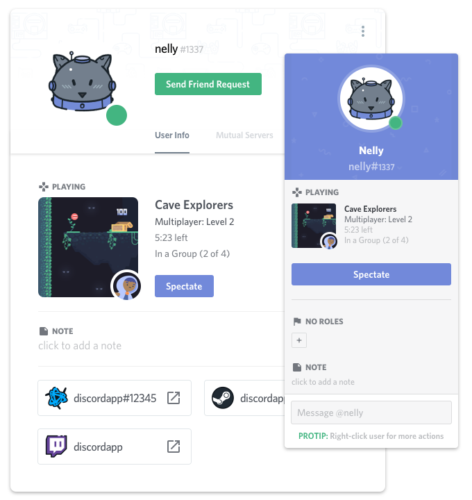

# Discord Rich Presence Client
Discord is one of the most popular communicator all over the world. Discord ensures text and voice communiacton protocol for many communities. Developers of this amazing communicator gives opportunity for other independent developers to integrate thier products with Discord. One of the most interesting option is to share your's activty with rest of the community. This can be reached with Discord Rich Presecne.

## What is Discord Rich Presence?
<p align="center">
	
</p>
Discord Rich Presence allows you to show other users in the community what are you doing right now in really elegant and efficient way. You can display status message, activity description, timestamp when you started and give opportunity to specte or join the game that you are actually playing.

## About this project
There is official Discord Rich Presence API ([discord-rpc](https://github.com/discordapp/discord-rpc)) but officialy it supports only C, C++, Unity and Unreal Engine. There are also featured some unofficial wrappers in other languages but not in Python. This project contains the simple wrapper written in Python to communicate with Discord app via [inter-process communication techniques](https://en.wikipedia.org/wiki/Inter-process_communication). 


In the package you can find: 
1. The most important tools that provides methods to connect to Discord and communicate with it via Discord IPC socket.
2. Simple example how to use Discord Rich Presence.

Wrapper is easily extendable, just read the code/documentation and write your own payload that covers your point of interests. It should be easy because you are developer, am I right?

Full documentation can be found here: [Welcome to documentation of Discord Rich Presence Client!](docs/ready_docs/html)

## Getting started
There is no package avaible in Python PyPi because there are only four short files that you should be interseted in:

* **discord_ipc.py** - Discord Rich Presence API wrapper
* **os_dependencies.py** - expected localizations to Discord IPC socket on specific platforms
* **payloads.py** - templates and descriptions of payloads that can be send to Discord
* **discord_rpc_client.py** - main entry point, example usage of wrapper

You can find all necessary files in folder named **src**, just download it.

There is no need to install **requirements.txt** because it contains packages needed to use Sphinx documentation tool only.

Firstly you should visit [Discord developers site](https://discordapp.com/developers/applications/me) and register your application. After that your unique **Client ID** should be generated. Nextly download **src** folder from the repository and open file named **discord_rpc_client.py**.

In line 22 you should replace **ClientID** parameter with ID generated in last step.
```
ipc = discord_ipc.DiscordIPC("ClientID")
```

You are ready to go just save the file, open Discord app and run program with command in terminal:
```
python discrod_rpc_client.py
```

Community should see that your status changed!

## Supported platforms
|OS|status|
|:----------:|:----------:|
|**Windows**|:white_check_mark: *tested*|
|**Linux**|:white_check_mark: *tested*|
|**MacOS**|:x: *untested*|

## Bugs and issues
If any error occured, I will be really happy to help you with the problem but it will be nice to see the error message. You can change logger mode and paste log contnet into [GitHub issue page](https://github.com/MashMB/discord_rpc_client/issues). 

Replace line 23 in **discord_ipc.py** with:
```
logger_level = "DEBUG"
```

After that run program:
```
python discrod_rpc_client.py
```

Open discord_ipc.log file and copy the conent.

## License
The MIT License (MIT)

Copyright (c) 2018 Maciej Bedra

Permission is hereby granted, free of charge, to any person obtaining a copy
of this software and associated documentation files (the "Software"), to deal
in the Software without restriction, including without limitation the rights
to use, copy, modify, merge, publish, distribute, sublicense, and/or sell
copies of the Software, and to permit persons to whom the Software is
furnished to do so, subject to the following conditions:

The above copyright notice and this permission notice shall be included in all
copies or substantial portions of the Software.

THE SOFTWARE IS PROVIDED "AS IS", WITHOUT WARRANTY OF ANY KIND, EXPRESS OR
IMPLIED, INCLUDING BUT NOT LIMITED TO THE WARRANTIES OF MERCHANTABILITY,
FITNESS FOR A PARTICULAR PURPOSE AND NONINFRINGEMENT. IN NO EVENT SHALL THE
AUTHORS OR COPYRIGHT HOLDERS BE LIABLE FOR ANY CLAIM, DAMAGES OR OTHER
LIABILITY, WHETHER IN AN ACTION OF CONTRACT, TORT OR OTHERWISE, ARISING FROM,
OUT OF OR IN CONNECTION WITH THE SOFTWARE OR THE USE OR OTHER DEALINGS IN THE
SOFTWARE.